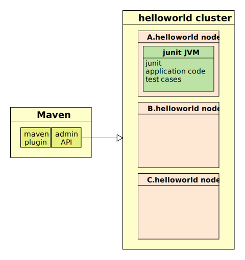
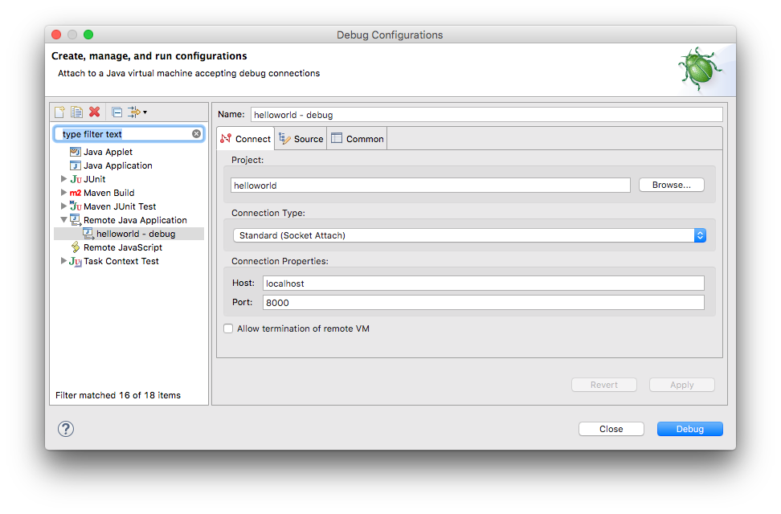
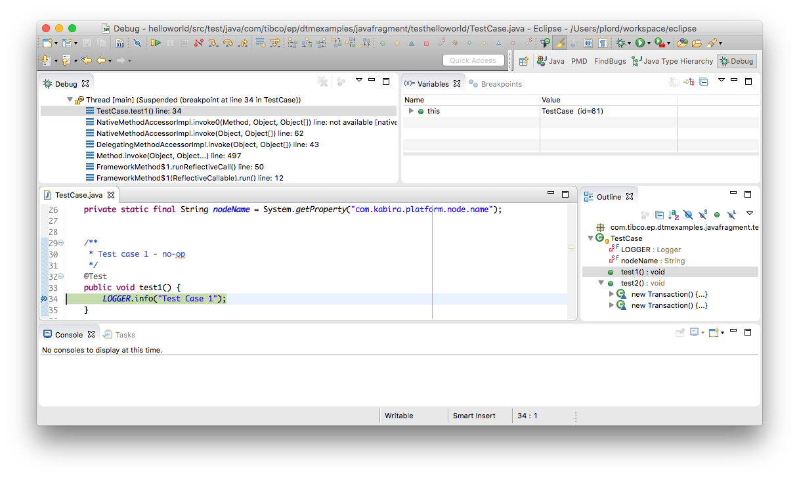

# General

* [Codeline structure](#codeline-structure)
* [Dependency scope](#dependency-scope)
* [Parent poms](#parent-poms)
* [Build, test and install](#build-test-and-install)
* [Cleaning up](#cleaning-up)
* [Build only](#build-only)
* [Skipping start and stop nodes](#skipping-start-and-stop-nodes)
* [Summary of command-line flags](#summary-of-command-line-flags)
* [Multiple test nodes](#multiple-test-nodes)
* [Install node parameters](#install-node-parameters)
* [Start node parameters](#start-node-parameters)
* [Run a single junit test case](#run-a-single-junit-test-case)
* [Administration commands when unit testing](#administration-commands-when-unit-testing)
* [Usernames and passwords](#usernames-and-passwords)
* [Discovery port](#discovery-port)
* [Creating additional artifacts](#creating-additional-artifacts)
* [javaOptions and nodeOptions](#javaoptions-and-nodeoptions)
* [Debugging](#debugging)
* [System variables](#system-variables)
* [Environment variables](#environment-variables)
* [Running tests more than once](#running-tests-more-than-once)
* [JVM exit](#jvm-exit)
* [Managed object leak detection support](#managed-object-leak-detection-support)
* [Migrating from surefire](#migrating-from-surefire)
* [Additional support product](#additional-support-product)
* [Maven Archetypes](#maven-archetypes)
* [SonarQube analysis](#sonarqube-analysis)

Much of how to use the maven plugin is consistent across event processing
technologies - so the non-specific usages are discussed here.

<a name="codeline-structure"></a>

## Codeline structure

Maven has a [standard directory layout](https://maven.apache.org/guides/introduction/introduction-to-the-standard-directory-layout.html)
- this forms the basis of the recommended structure.

<a name="dependency-scope"></a>

## Dependency scope

Maven defines a [dependency scope](https://maven.apache.org/guides/introduction/introduction-to-dependency-mechanism.html#Dependency_Scope) 
for each dependency.  So :
  
* **compile** - dependency is included when compiling application, compiling 
    test cases, running test cases and running application.  Dependency is
    included in shipped artifacts.
  
* **provided** - dependency is included when compiling application and 
    compiling test cases.  The dependency is not included when running test 
    cases or the application ( since its assumed that the runtime already 
    provides this dependency ).  Dependency is not included in shipped 
    artifacts.
  
* **runtime** - dependency is included when running test cases and running 
    application.  Dependency is not included when compiling.  Dependency is 
    included in shipped artifacts.

* **test** - dependency is included when compiling test cases and running test 
    cases.  Dependency is not included when compiling application.  Dependency 
    is included in shipped artifacts.

<a name="parent-poms"></a>

## Parent poms

Parent poms are provided to simplify project poms as much as possible and 
includes dependency version management and any common build rules.  

These are :

| Use                     | GroupId                | ArtifactId           |  Version  |
|-------------------------|------------------------|----------------------|-----------|
| Common                  | com.tibco.ep.sb.parent | common               | StreamBase product version ( eg 10.4.0 )  |
| Java fragment           | com.tibco.ep.sb.parent | ep-java-fragment     | StreamBase product version ( eg 10.4.0 )  |
| Eventflow fragment      | com.tibco.ep.sb.parent | ep-eventflow-fragment| StreamBase product version ( eg 10.4.0 )  |
| Liveview fragment       | com.tibco.ep.sb.parent | ep-liveview-fragment | StreamBase product version ( eg 10.4.0 )  |
| Application             | com.tibco.ep.sb.parent | ep-application       | StreamBase product version ( eg 10.4.0 )  |
| Application with docker | com.tibco.ep.sb.parent | ep-application-docker| StreamBase product version ( eg 10.4.0 )  |

<a name="build-test-and-install"></a>

## Build, test and install

Run **mvn install**. This will compile the java files in the project, typecheck the EventFlow 
fragment, trigger the fragment code generation, compile the generated code, package the EventFlow 
fragment in an EventFlow archive, start a test node, execute the tests, and stop the test node.
For example:

``` shell
$ mvn install
[INFO] Scanning for projects...
[INFO]
[INFO] -----------------------< com.example:helloworld >-----------------------
[INFO] Building Java Fragment - hello world 3.0.0
[INFO] -----------------------[ ep-eventflow-fragment ]------------------------
[INFO]
[INFO] --- ep-maven-plugin:2.1.0:install-product (default-install-product-1) @ helloworld ---
[INFO] com.tibco.ep.sb.rt:platform_osxx86_64:zip:11.0.0:test already installed manually to /Users/flionell/tibco/dev/core
[INFO]
[INFO] --- ep-maven-plugin:2.1.0:set-resources (default-set-resources) @ helloworld ---
[INFO]
[INFO] --- maven-enforcer-plugin:3.0.0:enforce (hard-build-requirements) @ helloworld ---
[INFO]
[INFO] --- maven-resources-plugin:3.1.0:resources (default-resources) @ helloworld ---
[INFO] Using 'UTF-8' encoding to copy filtered resources.
[INFO] Copying 0 resource
[INFO] Copying 0 resource
[INFO] Copying 2 resources
[INFO]
[INFO] --- ep-maven-plugin:2.1.0:unpack-nar (default-unpack-nar) @ helloworld ---
[INFO]
[INFO] --- ep-maven-plugin:2.1.0:unpack-fragment (default-unpack-fragment) @ helloworld ---
[INFO]
[INFO] --- maven-compiler-plugin:3.8.1:compile (default-compile-1) @ helloworld ---
[INFO] Nothing to compile - all classes are up to date
[INFO]
[INFO] --- ep-maven-plugin:2.1.0:generate-main-eventflow (default-generate-main-eventflow) @ helloworld ---
[INFO] Found 1 module
[INFO]
[INFO] --- ep-maven-plugin:2.1.0:compile-eventflow-fragment (default-compile-eventflow-fragment) @ helloworld ---
[INFO]
[INFO] --- maven-compiler-plugin:3.8.1:compile (default-compile) @ helloworld ---
[INFO] Changes detected - recompiling the module!
[INFO] Compiling 1 source file to /Users/flionell/Documents/StreamBase Studio 11.0 Workspace/helloworld/target/classes
[INFO]
[INFO] --- maven-resources-plugin:3.1.0:testResources (default-testResources) @ helloworld ---
[INFO] Using 'UTF-8' encoding to copy filtered resources.
[INFO] Copying 0 resource
[INFO] Copying 0 resource
[INFO]
[INFO] --- maven-compiler-plugin:3.8.1:testCompile (default-testCompile) @ helloworld ---
[INFO] Changes detected - recompiling the module!
[INFO] Compiling 1 source file to /Users/flionell/Documents/StreamBase Studio 11.0 Workspace/helloworld/target/test-classes
[INFO]
[INFO] --- ep-maven-plugin:2.1.0:generate-test-eventflow (default-generate-test-eventflow) @ helloworld ---
[INFO] Found 0 module
[INFO]
[INFO] --- maven-compiler-plugin:3.8.1:testCompile (default-testCompile-1) @ helloworld ---
[INFO] Changes detected - recompiling the module!
[INFO] Compiling 1 source file to /Users/flionell/Documents/StreamBase Studio 11.0 Workspace/helloworld/target/test-classes
[INFO]
[INFO] --- ep-maven-plugin:2.1.0:check-testcases (default-check-testcases) @ helloworld ---
[INFO]
[INFO] --- ep-maven-plugin:2.1.0:start-nodes (default-start-nodes) @ helloworld ---
[INFO] UDP port 59781 selected for discovery
[INFO] [A.helloworld] Running "install node"
[INFO] [A.helloworld] 	Installing node
[INFO] [A.helloworld] 		DEVELOPMENT executables
[INFO] [A.helloworld] 		File shared memory
[INFO] [A.helloworld] 		7 concurrent allocation segments
[INFO] [A.helloworld] 		Host name MacBookPro-of-flionell.local
[INFO] [A.helloworld] 		Starting node services
[INFO] [A.helloworld] 		Loading node configuration
[INFO] [A.helloworld] 		Auditing node security
[INFO] [A.helloworld] 		Administration port is 9831
[INFO] [A.helloworld] 		Service name is A.helloworld
[INFO] [A.helloworld] 	Node installed
[INFO] [A.helloworld] Finished "install node"
[INFO] [helloworld] Running "start node"
[INFO] [A.helloworld] 	Starting node
[INFO] [A.helloworld] 		Loading node configuration
[INFO] [A.helloworld] 		Auditing node security
[INFO] [A.helloworld] 		Host name MacBookPro-of-flionell.local
[INFO] [A.helloworld] 		Administration port is 9831
[INFO] [A.helloworld] 		Service name is A.helloworld
[INFO] [A.helloworld] 	Node started
[INFO] [helloworld] Finished "start node"
[INFO]
[INFO] --- ep-maven-plugin:2.1.0:test-eventflow-fragment (default-test-eventflow-fragment) @ helloworld ---
[INFO] [dtm] INFO: Deploy tool version: [TIBCO Distributed Transactional Memory Platform 11.0.0 (build 2202210815)] starting at [Mon Feb 28 11:12:20 CET 2022]
[INFO] [dtm] INFO: Node version: [TIBCO Streaming Runtime 11.0.0 (build 2202210837)]
[INFO] [dtm] INFO: Starting com.tibco.ep.buildmavenplugin.surefire.Runner on node A.helloworld ...
[INFO] [dtm] INFO: com.tibco.ep.buildmavenplugin.surefire.Runner started on JVM com_tibco_ep_buildmavenplugin_surefire_Runner0 on node A.helloworld.
[INFO] [A.helloworld] No user-defined Logback configuration, using product default configuration
[INFO] [A.helloworld] 2022-02-28 11:12:23.986000+0100 [516:main] INFO  com.tibco.ep.dtm.stdout:
[INFO] [A.helloworld] -------------------------------------------------------
[INFO] [A.helloworld]  T E S T S
[INFO] [A.helloworld] -------------------------------------------------------
[INFO] [A.helloworld] Running com.example.helloworld.TestCase
[INFO] [A.helloworld] Test Case 1
[INFO] [A.helloworld] Tests run: 1, Failures: 0, Errors: 0, Skipped: 0, Time elapsed: 3.853 sec
[INFO] [A.helloworld] 2022-02-28 11:12:27.850000+0100 [516:main] INFO  com.tibco.ep.dtm.stdout:
[INFO] [A.helloworld] Results :
[INFO] [A.helloworld] 2022-02-28 11:12:27.851000+0100 [516:main] INFO  com.tibco.ep.dtm.stdout:
[INFO] [A.helloworld] Tests run: 1, Failures: 0, Errors: 0, Skipped: 0
[INFO] [A.helloworld] 2022-02-28 11:12:27.851000+0100 [516:main] INFO  com.tibco.ep.dtm.stdout:
[INFO] [dtm] INFO: Engine com_tibco_ep_buildmavenplugin_surefire_Runner0 on node [A.helloworld] exited with status [0]
[INFO] [helloworld] Finished "deploy com.tibco.ep.buildmavenplugin.surefire.Runner"
[INFO]
[INFO] --- ep-maven-plugin:2.1.0:stop-nodes (default-stop-nodes-1) @ helloworld ---
[INFO] [A.helloworld] Running "stop node"
[INFO] [A.helloworld] 	Stopping node
[INFO] [A.helloworld] 		Engine application::com_tibco_ep_buildmavenplugin_surefire_Runner0 stopped
[INFO] [A.helloworld] 	Node stopped
[INFO] [A.helloworld] Finished "stop node"
[INFO] [A.helloworld] Running "remove node"
[INFO] [A.helloworld] 	Removing node
[INFO] [A.helloworld] 		Shutting down node services
[INFO] [A.helloworld] 		Engine System::administration stopped
[INFO] [A.helloworld] 	Node removed
[INFO] [A.helloworld] Finished "remove node"
[INFO]
[INFO] --- ep-maven-plugin:2.1.0:package-eventflow-fragment (default-package-eventflow-fragment) @ helloworld ---
[INFO] Building zip: /Users/flionell/Documents/StreamBase Studio 11.0 Workspace/helloworld/target/helloworld-3.0.0-ep-eventflow-fragment.zip
[INFO]
[INFO] >>> maven-source-plugin:3.2.1:jar (attach-sources) > generate-sources @ helloworld >>>
[INFO]
[INFO] --- ep-maven-plugin:2.1.0:install-product (default-install-product-1) @ helloworld ---
[INFO] com.tibco.ep.sb.rt:platform_osxx86_64:zip:11.0.0:test already installed manually to /Users/flionell/tibco/dev/core
[INFO]
[INFO] --- ep-maven-plugin:2.1.0:set-resources (default-set-resources) @ helloworld ---
[INFO]
[INFO] --- maven-enforcer-plugin:3.0.0:enforce (hard-build-requirements) @ helloworld ---
[INFO]
[INFO] <<< maven-source-plugin:3.2.1:jar (attach-sources) < generate-sources @ helloworld <<<
[INFO]
[INFO]
[INFO] --- maven-source-plugin:3.2.1:jar (attach-sources) @ helloworld ---
[INFO] Building jar: /Users/flionell/Documents/StreamBase Studio 11.0 Workspace/helloworld/target/helloworld-3.0.0-sources.jar
[INFO]
[INFO] --- maven-javadoc-plugin:3.3.1:jar (attach-javadocs) @ helloworld ---
[INFO]
[INFO] --- maven-install-plugin:2.5.2:install (default-install) @ helloworld ---
[INFO] Installing /Users/flionell/Documents/StreamBase Studio 11.0 Workspace/helloworld/target/helloworld-3.0.0-ep-eventflow-fragment.zip to /Users/flionell/tibco/dev/core/BUILD/repository/com/example/helloworld/3.0.0/helloworld-3.0.0.zip
[INFO] Installing /Users/flionell/Documents/StreamBase Studio 11.0 Workspace/helloworld/pom.xml to /Users/flionell/tibco/dev/core/BUILD/repository/com/example/helloworld/3.0.0/helloworld-3.0.0.pom
[INFO] Installing /Users/flionell/Documents/StreamBase Studio 11.0 Workspace/helloworld/target/helloworld-3.0.0-sources.jar to /Users/flionell/tibco/dev/core/BUILD/repository/com/example/helloworld/3.0.0/helloworld-3.0.0-sources.jar
[INFO] ------------------------------------------------------------------------
[INFO] BUILD SUCCESS
[INFO] ------------------------------------------------------------------------
[INFO] Total time:  37.467 s
[INFO] Finished at: 2022-02-28T11:12:34+01:00
[INFO] ------------------------------------------------------------------------
```

<a name="cleaning-up"></a>

## Cleaning up

To clean up after either a failed or successful test run, use the clean 
target.  If any nodes are still running they will be stopped and removed
before the directory is cleaned.

An example run is shown below :

``` shell
$ mvn clean
[INFO] Scanning for projects...
[INFO]                                                                         
[INFO] ------------------------------------------------------------------------
[INFO] Building Java Fragment - hello world 3.0.0
[INFO] ------------------------------------------------------------------------
[INFO] 
[INFO] --- ep-maven-plugin:1.0.0:install-product (default-install-product) @ helloworld ---
[INFO] com.tibco.ep.dtm:platform_osxx86_64:zip:3.0.0:test product is already installed manually
[INFO] 
[INFO] --- ep-maven-plugin:1.0.0:stop-nodes (default-stop-nodes) @ helloworld ---
[INFO] [helloworld] Starting stop node
[INFO] [helloworld] Starting remove node
[INFO] 
[INFO] --- maven-clean-plugin:3.0.0:clean (default-clean) @ helloworld ---
[INFO] Deleting /Users/plord/workspace/dtmexamples/java-fragments/helloworld/target
[INFO] ------------------------------------------------------------------------
[INFO] BUILD SUCCESS
[INFO] ------------------------------------------------------------------------
[INFO] Total time: 2.998 s
[INFO] Finished at: 2016-01-20T10:14:03+00:00
[INFO] Final Memory: 17M/309M
[INFO] ------------------------------------------------------------------------
```

<a name="build-only"></a>

## Build only

To only build the java fragment (ie skip running test cases) use :

``` shell
$ mvn -DskipTests install
```

<a name="skipping-start-and-stop-nodes"></a>

## Skipping start and stop nodes

To examine the node runtime after the test cases, the node stop step can be
skipped :

``` shell
$ mvn -DskipStop install
...
[INFO] --- ep-maven-plugin:1.0.0:stop-nodes (default-stop-nodes-1) @ helloworld ---
[INFO] Stop nodes is skipped
...
$ monitor target/A.helloworld/ossm
```

Also, the test nodes can be stopped but not removed :

``` shell
$ mvn -DskipRemove install
...
[INFO] --- ep-maven-plugin:1.0.0:stop-nodes (default-stop-nodes-1) @ helloworld ---
[INFO] [helloworld] Running "stop node"
[INFO] [A.helloworld] Stopping node 
[INFO] [A.helloworld] Dtm::distribution stopping 
[INFO] [A.helloworld] application::com_tibco_ep_buildmavenplugin_surefire_Runner0 stopped 
[INFO] [A.helloworld] Node stopped 
[INFO] Remove nodes is skipped
...
$ monitor target/A.helloworld/ossm
```
  
To re-use the same test nodes for multiple runs, the start and stop nodes
can be skipped :

```
$ mvn -DskipStop install
...
$ mvn -DskipStart -DskipStop install
...
```

If no test cases are found, **skipTests** is automatically set to true.
  
Note that in the default case (discovery port is not specified), the selected
discovery port is persisted in the build directory 
(by default target/discovery.port) and will be used on subsequent runs.

<a name="summary-of-command-line-flags"></a>

## Summary of command-line flags

|  Options         | Install nodes | Start nodes | Run test | Stop nodes | Remove nodes |
|------------------|---------------|-------------|----------|------------|--------------|
|                  | yes           | yes         | yes      | yes        | yes          |
| -DskipTests      | no            | no          | no       | no         | no           |
| -DskipStart      | no            | no          | yes      | yes        | yes          |
| -DskipStop       | yes           | yes         | yes      | no         | no           |
| -DskipRemove     | yes           | yes         | yes      | yes        | no           |
| -DskipInstall    | no            | yes         | yes      | yes        | yes          |
| -DskipStart -DskipStop | no      | no          | yes      | no         | no           |
| -DinstallOnly    | yes           | no          | no       | no         | no           |

<a name="multiple-test-nodes"></a>

## Multiple test nodes

Multiple test nodes can be defined to override a single node named A.
For example :

``` xml
...
            <plugin>
                <groupId>com.tibco.ep</groupId>
                <artifactId>ep-maven-plugin</artifactId>
                <extensions>true</extensions>
                <configuration>
                    <nodes>
                        <node>A</node>
                        <node>B</node>
                        <node>C</node>
                    </nodes>
                </configuration>
            </plugin>
...
```

The application code, test cases and junit are deployed to the
three specified test nodes :
  


A variation of this is to only run junit on one node :

``` xml
...
            <plugin>
                <groupId>com.tibco.ep</groupId>
                <artifactId>ep-maven-plugin</artifactId>
                <extensions>true</extensions>
                <configuration>
                    <nodes>
                        <node>A</node>
                        <node>B</node>
                        <node>C</node>
                    </nodes>
                    <serviceName>A.helloworld</serviceName>
                </configuration>
            </plugin>
...
```



When test cases involve high availability tests, then it may be necessary to
start a test application on all nodes before starting junit :

``` xml
...
            <plugin>
                <groupId>com.tibco.ep</groupId>
                <artifactId>ep-maven-plugin</artifactId>
                <extensions>true</extensions>
                <configuration>
                    <nodes>
                        <node>A</node>
                        <node>B</node>
                        <node>C</node>
                    </nodes>
                    <serviceName>A.helloworld</serviceName>
                    <testMain>com.tibco.ep.dtm.appdeploytest.Main</testMain>
                </configuration>
            </plugin>
...
```


<a name="install-node-parameters"></a>

## Install node parameters

Install node parameters can be specified via <<installArguments>>
option - see epadmin help for permitted parameters  

For example :

``` xml
...
            <plugin>
                <groupId>com.tibco.ep</groupId>
                <artifactId>ep-maven-plugin</artifactId>
                <extensions>true</extensions>
                <configuration>
                    <installArguments>
                        <buildtype>DEVELOPMENT</buildtype>
                    </installArguments>
                </configuration>
            </plugin>
...
```

<a name="start-node-parameters"></a>

## Start node parameters

Start node parameters can be specified via <<startArguments>>
option - see epadmin help for permitted parameters.  

For example :

``` xml
...
            <plugin>
                <groupId>com.tibco.ep</groupId>
                <artifactId>ep-maven-plugin</artifactId>
                <extensions>true</extensions>
                <configuration>
                    <startArguments>
                        <maxretries>2000</maxretries>
                    </startArguments>
                </configuration>
            </plugin>
...
```

<a name="run-a-single-junit-test-case"></a>

## Run a single junit test case

Running a single junit test case is possible by passing the <<test>> maven
property. for example :

``` shell
$ mvn install -Dtest=FilterTest
```

<a name="administration-commands-when-unit-testing"></a>

## Administration commands when unit testing

Since maven has only one phase (test) for unit testing, its not possible to
configure administration commands in a unit test.  However, it is possible to
use integration instead of unit testing in the java-fragment which does allow
for administration commands.  An example is shown below :

``` xml
....
            <plugin>
                <groupId>com.tibco.ep</groupId>
                <artifactId>ep-maven-plugin</artifactId>
                <extensions>true</extensions>

                <executions>

                    <execution>
                        <id>start nodes</id>
                        <phase>pre-integration-test</phase>
                        <goals><goal>start-nodes</goal></goals>
                    </execution>

                    <execution>
                        <id>enable statistics</id>
                        <phase>pre-integration-test</phase>
                        <goals><goal>administer-nodes</goal></goals>
                        <configuration>
                            <command>enable</command>
                            <target>statistics</target>
                            <arguments>
                                <statistics>transaction,object</statistics>
                            </arguments>
                        </configuration>
                    </execution>

                    <execution>
                        <id>test nodes</id>
                        <phase>integration-test</phase>
                        <goals><goal>test-java-fragment</goal></goals>
                    </execution>

                    <execution>
                        <id>display statistics</id>
                        <phase>integration-test</phase>
                        <goals><goal>administer-nodes</goal></goals>
                        <configuration>
                            <command>display</command>
                            <target>statistics</target>
                            <arguments>
                                <statistics>transaction,object</statistics>
                            </arguments>
                        </configuration>
                    </execution>

                    <execution>
                        <id>stop nodes</id>
                        <phase>post-integration-test</phase>
                        <goals><goal>stop-nodes</goal></goals>
                    </execution>

                </executions>

            </plugin>
....
```

One such use is failover testing with the **kill node** commmand :

``` xml
....
                    <execution>
                        <id>kill node A</id>
                        <phase>integration-test</phase>
                        <goals><goal>administer-nodes</goal></goals>
                        <configuration>
                            <skipTests>${skipTests}</skipTests>
                            <serviceName>A.${project.artifactId}</serviceName>
                            <command>kill</command>
                            <target>node</target>
                        </configuration>
                    </execution>
....
```

<a name="usernames-and-passwords"></a>

## Usernames and passwords

Usually when testing, node authentication works via the platform credentials -
however, the user name and password can be provided if required :

``` xml
....
                    <execution>
                        <id>display statistics</id>
                        <phase>integration-test</phase>
                        <goals><goal>administer-nodes</goal></goals>
                        <configuration>
                            <skipTests>${skipTests}</skipTests>
                            <command>display</command>
                            <target>statistics</target>
                            <userName>guest</userName>
                            <password>guest</password>
                            <arguments>
                                <statistics>transaction,object</statistics>
                            </arguments>
                        </configuration>
                    </execution>
....
```

<a name="discovery-port"></a>

## Discovery port

It is assumed that running builds and test cases with maven might be on a
shared development server - hence the default for the discovery port is to 
choose a unused port to avoid conflicts with other developers.

If this isn't the case, then the discovery port can be fixed with :

``` xml
....
            <plugin>
                <groupId>com.tibco.ep</groupId>
                <artifactId>ep-maven-plugin</artifactId>
                <extensions>true</extensions>
                <configuration>
                    <discoveryPort>4000</discoveryPort>
                </configuration>
            </plugin>
....
```

Or on the command line :

``` shell
  $ mvn -DdiscoveryPort=4000 ...
```

<a name="creating-additional-artifacts"></a>

## Creating additional artifacts

Other maven plugins can be configured to generate additional artifacts.  
Some examples are shown below :

``` xml
....
            <!-- create a source jar file -->
            <plugin>
                <groupId>org.apache.maven.plugins</groupId>
                <artifactId>maven-source-plugin</artifactId>
                <version>2.4</version>
                <executions>
                    <execution>
                        <phase>package</phase>
                        <goals>
                            <goal>jar-no-fork</goal>
                        </goals>
                    </execution>
                </executions>
            </plugin>
            
            <!-- create a javadoc jar file -->
            <plugin>
                <groupId>org.apache.maven.plugins</groupId>
                <artifactId>maven-javadoc-plugin</artifactId>
                <version>2.10.3</version>
                <executions>
                    <execution>
                        <phase>package</phase>
                        <goals>
                            <goal>jar</goal>
                        </goals>
                    </execution>
                </executions>
            </plugin>
....
```

The [maven-source-plugin](https://maven.apache.org/plugins/maven-source-plugin/)
will include any files found in source directory paths — so will include
java, EventFlow, and LiveView source files.

<a name="javaoptions-and-nodeoptions"></a>

## javaOptions and nodeOptions

Node deployment supports both java options and node options.
  
*   **javaOptions** in the pom.xml allows setting options to pass to the JVM.
    For example garbage collection flags.  See also http://docs.oracle.com/javase/8/docs/technotes/tools/unix/java.html
    for details.  Java options may also be set on the maven command line using
    **-Doptions**.
    
*   **nodeOptions** in the pom.xml allows setting of the node deployment
    parameters.  See **java -jar $TIBCO_EP_HOME/distrib/kabira/java/deploy.jar help**.
    Node options may also be set on the maven command line using
    **-DnodeOptions**.

Note that reading the client configuration file is disabled by default (i.e., ignoreoptionsfile is set to true) —
this is to give stability to test runs.  However, the **nodeOptions** may be used to override this default :

```
$ mvn -DnodeOptions=ignoreoptionsfile=false ...
```

<a name="debugging"></a>

## Debugging

To see what classes are being loaded by the deployed application, enable the 
verbose flag to the jvm :

``` xml
            <plugin>
                <groupId>com.tibco.ep</groupId>
                <artifactId>ep-maven-plugin</artifactId>
                <extensions>true</extensions>
                <configuration>
                    <javaOptions>
                        <javaOption>-verbose</javaOption>
                    </javaOptions>
                </configuration>
            </plugin>  
```

To capture the garbage collection log ( see also https://docs.oracle.com/javase/8/docs/technotes/guides/vm/gctuning )
on the deployed application :

``` xml
            <plugin>
                <groupId>com.tibco.ep</groupId>
                <artifactId>ep-maven-plugin</artifactId>
                <extensions>true</extensions>
                <configuration>
                    <javaOptions>
                        <javaOption>-XX:+PrintGCDetails</javaOption>
                        <javaOption>-XX:+PrintGCTimeStamps</javaOption>
                        <javaOption>-XX:+PrintGCDateStamps</javaOption>
                        <javaOption>-XX:+UseGCLogFileRotation</javaOption>
                        <javaOption>-XX:NumberOfGCLogFiles=10</javaOption>
                        <javaOption>-XX:GCLogFileSize=100M</javaOption>
                        <javaOption>-Xloggc:gc.log</javaOption>		    
                    </javaOptions>
                </configuration>
            </plugin>  
```

Note that this log will appear in the target node's runtime directory.

To capture the flight recorder log ( see also https://docs.oracle.com/javacomponents/jmc-5-5/jfr-runtime-guide/toc.htm ) 
on the deployed application :

``` xml
            <plugin>
                <groupId>com.tibco.ep</groupId>
                <artifactId>ep-maven-plugin</artifactId>
                <extensions>true</extensions>
                <configuration>
                    <javaOptions>
                        <javaOption>-XX:+UnlockCommercialFeatures</javaOption>
                        <javaOption>-XX:+FlightRecorder</javaOption>
                        <javaOption>-XX:StartFlightRecording=settings=profile,name=perf,dumponexit=true,filename=perf.jfr</javaOption>
                    </javaOptions>
                </configuration>
            </plugin>  
```

Note that this log will appear in the target node's runtime directory.

To enable maven debugging, use the -X option to maven.

``` shell
$ mvn -X ...
```
  
To start the runtime in DEVELOPMENT mode and to run test cases in DEVELOPMENT
mode use :
  
``` shell
$ mvn -Dbuild=DEVELOPMENT ...         
```

To start java debugging in unit tests, use the -Doptions option to 
pass additional deployment parameters and attach a java debugger when prompted :
  
``` shell
$ mvn -Doptions=remotedebug=true,suspend=true,remotedebugport=8000 ..
...
[INFO] --- ep-maven-plugin:1.0.0:test-java-fragment (default-test-java-fragment) @ helloworld ---
[INFO] [dtm] INFO: Deployment tool version: [TIBCO Distributed Transactional Memory Platform 3.0.0 (build 160315)] starting at [Thu Mar 17 10:42:35 GMT 2016]
[INFO] [dtm] INFO: Node version: [TIBCO Distributed Transactional Memory Platform 3.0.0 (build 160315)]
[INFO] [dtm] INFO: Starting com.tibco.ep.buildmavenplugin.surefire.Runner on node A.helloworld ...
[INFO] [dtm] INFO: com.tibco.ep.buildmavenplugin.surefire.Runner started on JVM com_tibco_ep_buildmavenplugin_surefire_Runner0 on node A.helloworld.
[INFO] [A.helloworld] Listening for transport dt_socket at address: 8000
```
  
In the eclipse debugger, for example, you can set a break point on your first
test case and use Debug Configurations to attach :
  


and debug :
  

  
When running integration tests with application archives, the deploy tool
debug=true option can be passed on the command line :

``` shell
$ mvn -Doptions=debug=true ..  
```

<a name="system-variables"></a>

## System variables

Java system variables may be set using the **systemPropertyVariables** 
configuration option :
  
``` xml
            <plugin>
                <groupId>com.tibco.ep</groupId>
                <artifactId>ep-maven-plugin</artifactId>
                <extensions>true</extensions>
                <configuration>
                    <systemPropertyVariables>
                        <MyVariable>MyValue</MyVariable>
                    </systemPropertyVariables>
                </configuration>
            </plugin>  
```

System variables can also be set using javaOptions :

``` xml
            <plugin>
                <groupId>com.tibco.ep</groupId>
                <artifactId>ep-maven-plugin</artifactId>
                <extensions>true</extensions>
                <configuration>
                    <javaOptions>
                        <javaOption>-DMyVariable=MyValue</javaOption>
                    </javaOptions>
                </configuration>
            </plugin>  
```

<a name="environment-variables"></a>

## Environment variables

Occasionally environment variables need to be set to support 3rdparty 
libraries.  The **environmentVariables** configuration option allows
setting environment variables to created processes :
  
``` xml
            <plugin>
                <groupId>com.tibco.ep</groupId>
                <artifactId>ep-maven-plugin</artifactId>
                <extensions>true</extensions>
                <configuration>
                    <environmentVariables>
                        <ORACLE_HOME>/home/oracle</ORACLE_HOME>
                    </environmentVariables>
                </configuration>
            </plugin>  
```

These can also be set on the command-line :

``` shell
$ mvn -DenvironmentVariables=ORACLE_HOME=/home/oracle,SYBASE_HOME=/home/sybase ...
```

<a name="running-tests-more-than-once"></a>

## Running tests more than once

Its possible to run tests multiple time = for example with different 
configurations.  An example is show below that runs tests with the runtime
in DEVELOPMENT mode first then PRODUCTION :

``` xml
            <plugin>
                <groupId>com.tibco.ep</groupId>
                <artifactId>ep-maven-plugin</artifactId>
                <extensions>true</extensions>
                <executions>
                    <execution>
                        <phase>test</phase>
                        <id>DEVELOPMENT</id>
                        <configuration>
                            <buildtype>DEVELOPMENT</buildtype>
                        </configuration>
                        <goals>
                            <goal>start-nodes</goal>
                            <goal>test-java-fragment</goal>
                            <goal>stop-nodes</goal>
                        </goals>
                    </execution>
                    <execution>
                        <phase>test</phase>
                        <id>PRODUCTION</id>
                        <configuration>
                            <buildtype>PRODUCTION</buildtype>
                        </configuration>
                        <goals>
                            <goal>start-nodes</goal>
                            <goal>test-java-fragment</goal>
                            <goal>stop-nodes</goal>
                        </goals>
                    </execution>
                </executions>
            </plugin>  
```

<a name="jvm-exit"></a>

## JVM exit

As with any JVM running on a node, the JVM exits when all non-daemon
threads complete - see [the developers guide](http://devzone.tibco.com/sites/streambase/latest/sb/sb-product/documentation/developersguide/ch04s01.html).
However, sometimes test cases do have threads that are not designed to
complete - in this case, the JVM running the tests can be forced to
call exit thus allowing the test case to always complete :
  
``` xml
            <plugin>
                <groupId>com.tibco.ep</groupId>
                <artifactId>ep-maven-plugin</artifactId>
                <extensions>true</extensions>
                <configuration>
                    <useSystemExit>true</useSystemExit>
                </configuration>
            </plugin>  
```

<a name="managed-object-leak-detection-support"></a>

## Managed object leak detection support

The DTM unit test framework supports detecting managed object leaks.  Sometimes a package is
designed to create managed objects and never delete them - such objects need to be masked
from leak detection to avoid false results.

The unit test framework allows specifying a list of managed object class names to ignore 
during leak detection :

``` xml
            <plugin>
                <groupId>com.tibco.ep</groupId>
                <artifactId>ep-maven-plugin</artifactId>
                <extensions>true</extensions>
                <configuration>
                    <ignoreLeaks>
                        <!-- list of manage object class names to be ignore from leak detection -->
                        <ignoreLeak>com.company.Singleton</ignoreLeak>
                        <ignoreLeak>com.company.NotInteresting</ignoreLeak>
                    </ignoreLeaks>
                </configuration>
            </plugin>  
```

By default this applies to the current unit test cases only.  However, if these managed objects
should also be ignored by downstream packages, the list of class names can be added to the
jar **META-INF/MANIFEST.MF** entry **IgnoreLeaks**, for example :
  
```
Manifest-Version: 1.0
Implementation-Title: My package
Implementation-Version: 1.0.0
Implementation-Vendor-Id: com.tibco.ep.dtm:highavailability
IgnoreLeaks: com.company.Singleton,com.company.NotInteresting
Created-By: Apache Maven 3.5.0
Build-Jdk: 1.8.0_151
Implementation-URL: http://www.tibco.com
Implementation-Vendor: Cloud Software Group, Inc.
```

To make this easier, the maven plugin sets the maven variable **${ignoreLeaks}** than can be
used with the [maven jar plugin](https://maven.apache.org/plugins/maven-jar-plugin/), for 
example :
  
``` xml
            <plugin>
                <groupId>com.tibco.ep</groupId>
                <artifactId>ep-maven-plugin</artifactId>
                <extensions>true</extensions>
                <configuration>
                    <ignoreLeaks>
                        <!-- list of manage object class names to be ignore from leak detection -->
                        <ignoreLeak>com.company.Singleton</ignoreLeak>
                        <ignoreLeak>com.company.NotInteresting</ignoreLeak>
                    </ignoreLeaks>
                </configuration>
            </plugin>
            <plugin>
                <groupId>org.apache.maven.plugins</groupId>
                <artifactId>maven-jar-plugin</artifactId>
                <configuration>
                    <archive>
                        <manifestEntries>
                            <!-- ${ignoreLeaks} created from ep-maven-plugin to add to jar mainifest for downstream use -->
                            <IgnoreLeaks>${ignoreLeaks}</IgnoreLeaks>
                        </manifestEntries>
                    </archive>
                </configuration>
            </plugin>
```

<a name="migrating-from-surefire"></a>

## Migrating from surefire

To migrate junit test cases running under maven-surefire-plugin to 
ep-maven-plugin so that tests cases are run on a node simply replace the 
surefire plugin :

``` xml
            <plugin>
                <groupId>org.apache.maven.plugins</groupId>
                <artifactId>maven-surefire-plugin</artifactId>
            </plugin>
```

with :

``` xml
            <plugin>
                <groupId>com.tibco.ep</groupId>
                <artifactId>ep-maven-plugin</artifactId>
                <extensions>true</extensions>
            </plugin>
```

<a name="additional-support-product"></a>

## Additional support product

On occasion, support may request installing the additional support release - 
this includes additional files to run the product in DEVELOPMENT mode to aid
diagnosing problems.  This can be included in a project build thus :

``` xml
    <dependencies>
        <dependency>
            <groupId>com.tibco.ep.dtm</groupId>
            <artifactId>support_platform_${com.tibco.platform}${com.tibco.arch}</artifactId>
            <type>zip</type>
            <version>version</version>
            <scope>test</scope>
        </dependency>
    </dependencies>
```

<a name="maven-archetypes"></a>

## Maven Archetypes

[Maven archetypes](https://maven.apache.org/guides/introduction/introduction-to-archetypes.html)
are templates that can be quickly instantiated into a project after providing
some variables.

The archetype site catalog contains the following archetypes :

* **eventflow-fragment-archetype** - creates a project containing a single 
    EventFlow fragment
  
* **java-fragment-archetype**> - creates a project containing a single java 
    fragment

* **liveview-fragment-archetype** - creates a project containing a single 
    LiveView fragment

* **application-archetype** - creates a project containing a single 
    application archive

* **application-docker-archetype** - creates a project containing a single 
    application archive.  With docker support.
    
* **eventflow-application-archetype** - creates a project containing a module 
    for an EventFlow fragment and a second module for an application archive 
    that includes the EventFlow fragment

* **eventflow-application-docker-archetype** - creates a project containing a module 
    for an EventFlow fragment and a second module for an application archive 
    that includes the EventFlow fragment.  With docker support.
    
* **java-application-archetype** - creates a project containing a module 
    for an java fragment and a second module for an application archive 
    that includes the java fragment

* **java-application-docker-archetype** - creates a project containing a module 
    for an java fragment and a second module for an application archive 
    that includes the java fragment.  With docker support.
    
* **liveview-application-archetype** - creates a project containing a module 
    for a LiveView fragment and a second module for an application archive 
    that includes the LiveView fragment

* **liveview-application-docker-archetype** - creates a project containing a module 
    for a LiveView fragment and a second module for an application archive 
    that includes the LiveView fragment.  With docker support.

    
Projects can be created from the archetype via the command-line, eclipse
new project wizard or Studio new project wizard.

Note that a requirement for [archetype:generate](https://maven.apache.org/archetype/maven-archetype-plugin/generate-mojo.html)
is that the archetype catalog is available the repository section in settings.xml.

To create a project interactively from the command-line run :

``` shell
$ mvn archetype:generate -DinteractiveMode=true
[INFO] Scanning for projects...
[INFO]                                                                         
[INFO] ------------------------------------------------------------------------
[INFO] Building Maven Stub Project (No POM) 1
[INFO] ------------------------------------------------------------------------
[INFO] 
[INFO] >>> maven-archetype-plugin:2.4:generate (default-cli) @ standalone-pom >>>
[INFO] 
[INFO] <<< maven-archetype-plugin:2.4:generate (default-cli) @ standalone-pom <<<
[INFO] 
[INFO] --- maven-archetype-plugin:2.4:generate (default-cli) @ standalone-pom ---
[INFO] Generating project in Interactive mode
[INFO] No archetype defined. Using maven-archetype-quickstart (org.apache.maven.archetypes:maven-archetype-quickstart:1.0)
Choose archetype:
1: http://artifacts.tibco.com/artifactory/ep-snapshots/archetype-catalog.xml -> com.tibco.ep:eventflow-fragment-archetype (Event Processing EventFlow Fragment Archetype)
2: http://artifacts.tibco.com/artifactory/ep-snapshots/archetype-catalog.xml -> com.tibco.ep:java-fragment-archetype (Event Processing Java Fragment Archetype)
3: http://artifacts.tibco.com/artifactory/ep-snapshots/archetype-catalog.xml -> com.tibco.ep:liveview-fragment-archetype (Event Processing LiveView Fragment Archetype)
4: http://artifacts.tibco.com/artifactory/ep-snapshots/archetype-catalog.xml -> com.tibco.ep:application-archetype (Event Processing Application Archetype)
5: http://artifacts.tibco.com/artifactory/ep-snapshots/archetype-catalog.xml -> com.tibco.ep:eventflow-application-archetype (Event Processing EventFlow Application Archetype)
6: http://artifacts.tibco.com/artifactory/ep-snapshots/archetype-catalog.xml -> com.tibco.ep:java-application-archetype (Event Processing Java Application Archetype)
7: http://artifacts.tibco.com/artifactory/ep-snapshots/archetype-catalog.xml -> com.tibco.ep:liveview-application-archetype (Event Processing LiveView Application Archetype)
Choose a number or apply filter (format: [groupId:]artifactId, case sensitive contains): : 
...
```

To create a project in batch mode from the command-line run :
  
``` shell
$ mvn archetype:generate -B \
   -DarchetypeGroupId=com.tibco.ep -DarchetypeArtifactId=eventflow-fragment-archetype -DarchetypeVersion=10.1.0 \
   -DgroupId=com.tibco.ep -DartifactId=effrag -Dpackage=com.tibco.ep.effrag -Dversion=1.0.0 -Dname="hello world" -Drepository=settings.xml
[INFO] Scanning for projects...
[INFO]                                                                         
[INFO] ------------------------------------------------------------------------
[INFO] Building Maven Stub Project (No POM) 1
[INFO] ------------------------------------------------------------------------
[INFO] 
[INFO] >>> maven-archetype-plugin:2.4:generate (default-cli) @ standalone-pom >>>
[INFO] 
[INFO] <<< maven-archetype-plugin:2.4:generate (default-cli) @ standalone-pom <<<
[INFO] 
[INFO] --- maven-archetype-plugin:2.4:generate (default-cli) @ standalone-pom ---
[INFO] Generating project in Batch mode
Downloading: http://artifacts.tibco.com/ep-maven-virtual/com/tibco/ep/eventflow-fragment-archetype/10.1.0/maven-metadata.xml
Downloading: http://artifacts.tibco.com/ep-snapshots/com/tibco/ep/eventflow-fragment-archetype/10.1.0/maven-metadata.xml
Downloaded: http://artifacts.tibco.com/ep-snapshots/com/tibco/ep/eventflow-fragment-archetype/10.1.0/maven-metadata.xml (991 B at 1.8 KB/sec)
Downloaded: http://artifacts.tibco.com/ep-maven-virtual/com/tibco/ep/eventflow-fragment-archetype/10.1.0/maven-metadata.xml (991 B at 1.4 KB/sec)
[INFO] ----------------------------------------------------------------------------
[INFO] Using following parameters for creating project from Archetype: eventflow-fragment-archetype:10.1.0
[INFO] ----------------------------------------------------------------------------
[INFO] Parameter: groupId, Value: com.tibco.ep
[INFO] Parameter: artifactId, Value: effrag
[INFO] Parameter: version, Value: 1.0.0
[INFO] Parameter: package, Value: com.tibco.ep.effrag
[INFO] Parameter: packageInPathFormat, Value: com/tibco/ep/effrag
[INFO] Parameter: eventflowDirectory, Value: src/main/eventflow
[INFO] Parameter: package, Value: com.tibco.ep.effrag
[INFO] Parameter: version, Value: 1.0.0
[INFO] Parameter: name, Value: hello world
[INFO] Parameter: groupId, Value: com.tibco.ep
[INFO] Parameter: repository, Value: settings.xml
[INFO] Parameter: artifactId, Value: effrag
[INFO] project created from Archetype in dir: /Users/plord/workspace/test-archetypes/effrag
[INFO] ------------------------------------------------------------------------
[INFO] BUILD SUCCESS
[INFO] ------------------------------------------------------------------------
[INFO] Total time: 2.351s
[INFO] Finished at: Mon Jan 30 15:50:38 GMT 2017
[INFO] Final Memory: 15M/491M
[INFO] ------------------------------------------------------------------------
```

The generated project makes use of a common parent pom for each product release -
this parent pom defines common dependency versions ( using managed dependencies )
to help keep project configurations simple.  The version of the parent pom
matches the main product version, so to upgrade a project from one product
version to another, only the version of the parent need change :

``` xml
....
    <!-- common definitions for this version of StreamBase -->
    <parent>
        <groupId>com.tibco.ep.sb.parent</groupId>
        <artifactId>ep-java-fragment</artifactId>
        <version>10.4.0</version>
    </parent>
....
```
  
Projects requiring additional common definitions are encouraged to create a
local parent pom :
  
``` xml
<?xml version="1.0" encoding="UTF-8"?>
<project xmlns="http://maven.apache.org/POM/4.0.0" xmlns:xsi="http://www.w3.org/2001/XMLSchema-instance" xsi:schemaLocation="http://maven.apache.org/POM/4.0.0 http://maven.apache.org/xsd/maven-4.0.0.xsd">

    <modelVersion>4.0.0</modelVersion>

    <groupId>com.company</groupId>
    <artifactId>parent</artifactId>
    <packaging>pom</packaging>
    <version>1.0.0</version>

    <!-- common definitions for this version of StreamBase -->
    <parent>
        <groupId>com.tibco.ep.sb.parent</groupId>
        <artifactId>ep-java-fragment</artifactId>
        <version>10.4.0</version>
    </parent>

....
    local definitions
....
</project>
```

and use this in the project pom.xml :

``` xml
....
    <!-- common definitions -->
    <parent>
        <groupId>com.company</groupId>
        <artifactId>parent</artifactId>
        <version>1.0.0</version>
    </parent>
....
```

<a name="sonarqube-analysis"></a>

## SonarQube analysis

A standard maven plugin for SonarQube can be used to gather and publish 
data to a [SonarQube](http://www.sonarqube.org/) server.  An example
pom.xml is shown below :

``` xml
....
    <properties>
        <sonar.host.url>http://somewebaddress</sonar.host.url>
        <sonar.projectName>${projectgroupId}.${projectartifactId}</sonar.projectName>
        <sonar.junit.reportsPath>${project.build.directory}/test-reports</sonar.junit.reportsPath>
        <sonar.working.directory>${project.build.directory}${file.separator}sonar</sonar.working.directory>
    </properties>
....
    <build>
        <plugins>

            <plugin>
                <groupId>org.codehaus.mojo</groupId>
                <artifactId>sonar-maven-plugin</artifactId>
                <version>2.7.1</version>
            </plugin>
....
        </plugins>        
    </build>
....
```

Since SonarQube will process the JUnit test report as well as
the source files in the tree, a typical run will include :

``` shell
$ mvn site:site
$ mvn sonar:sonar
```
